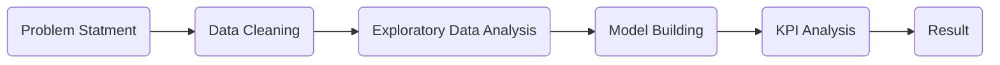

# ABC Supermarket Marketing Analytics
## Introduction

ABC Supermarket is a major player in UK, running multiple stores. They run a huge loyalty program with 250,000 participants. They has recently launched a new line of organic products and they wish to have a fast market penetration for these products, for which they plan to run an analytics enabled marketing campaign targeting their loyalty base first. They have already given free sample kits to around 10% of their loyalty program participants and recorded their purchase decision. For the remaining 90%, they plan to run their marketing campaign only on the most probable buyers.

They have shared data for the 10%, having the individual’s demographic plus loyalty program details, along with their purchase decision. They want to formulate an analytics enabled marketing strategy to target the most probable buyers from the remaining 90%. With the objective of optimising profitability, keeping an eye on market penetration, given revenue from a successful buyer is 146.1 pounds, the cost of promotional sample kit is 43.05 pounds.

## Project Strategy

The loyalty program dataset was downloaded from SKILLCATE channel on Youtube, more details can be seen on this link: [https://www.ibm.com/docs/en/spss-statistics/24.0.0?topic=system-sample-files.](https://www.ibm.com/docs/en/spss-statistics/24.0.0?topic=system-sample-files.)
The main steps for this project are summarized in the flowchart below:

## Insights
 -   Female customers have a higher potential to but organic products than male customers regardless of age.
-   Customers with age less than 40 have a highest purchase rate among all age groups.
-   As affluence grade rises, people are more willing to buy organic products.
-   Based on the Logistic Regression Model, to achieve market penetration goal, ABC supermarket could run campaigns on the top 40% probable buyers while to get the maximised profit, it is advised to target on the top 30% buyers.

